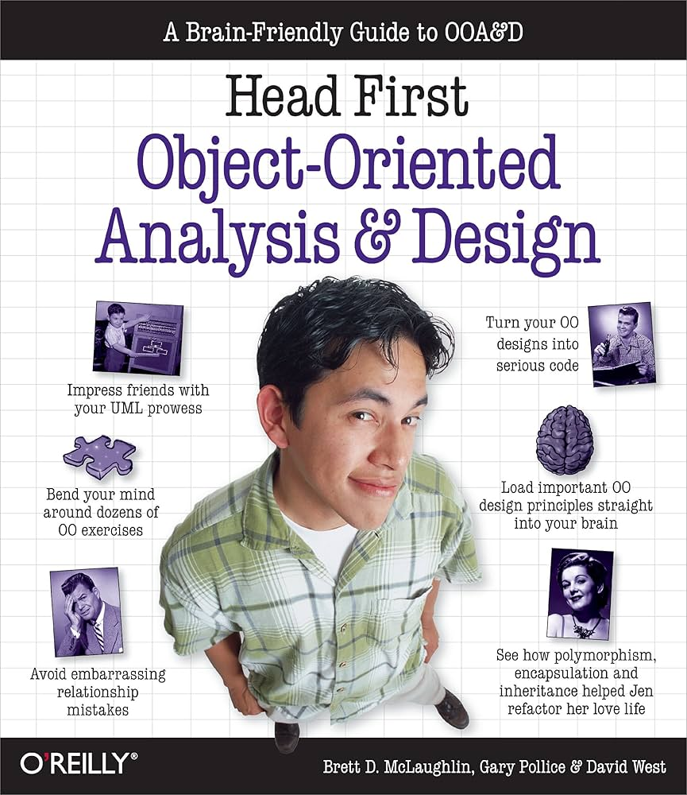

# Study Plan for *Head First Object-Oriented Analysis and Design*

  

This is a 6-week study plan to complete and understand the book. You can track your progress by marking [x] when you complete each day's task.

---

## Week 1: Introduction to OO Thinking

- [x] Saturday: Pages 1–23 - (Chapter 1) well-designed apps rock + great software + Make sure your software does what the customer wants it to do
- [x] Sunday: Pages 24–35 - Apply basic OO principles to add flexibility
- [x] Monday: Pages 36–54 - Strive for a maintainable, reusable design.
- [x] Tuesday: Pages 55–77 - (Chapter 2) gathering requirements Give Them What They Want
- [x] Wednesday: Pages 78–91 - Checking your requirements against your use cases
- [x] Thursday: Pages 92–110 - Use Cases Exposed 
- [x] Friday: Rest or recap

---

## Week 2: From Requirements to Design

- [x] Saturday: Pages 111–130 - (Chapter 3) requirements change + I Love You, You’re Perfect... Now Change
- [x] Sunday: Pages 131–144 - start coding the dog door again
- [x] Monday: Pages 145–163 - (Chapter 4) analysis , Taking Your Software into the Real World
- [x] Tuesday: Pages 164–179 - Maria won the MacBook Pro!
- [x] Wednesday: Pages 180–196 - From good analysis to good classes... , Maria’s Dog Door Class Diagram
- [x] Thursday: review
- [x] Friday: Rest

---

## Week 3: Flexible and Maintainable Design

- [x] Saturday: Pages 197–232 - (Chapter 5) (Part 1) good design = flexible software , Nothing Ever Stays the Same
- [x] Sunday: Pages 233–245 - (Chapter 5) (Part 2) good design = flexible software , Give Your Software a 30-minute Workout
- [x] Monday: Pages 246–278 - Death of a design (decision)
- [x] Tuesday: Pages 279–293 - (Chapter 6) solving really big problems , “My Name is Art Vandelay... I am an Architect”
- [ ] Wednesday: Pages 294–322 - Use cases don’t always help you see the big picture
- [ ] Thursday: Review
- [ ] Friday: Rest

---

## Week 4: Testing Your Designs

- [ ] Saturday: Pages 323–350 - (Chapter 7) architecture , Bringing Order to Chaos
- [ ] Sunday: Pages 351–370 - Writing test scenarios
- [ ] Monday: Pages 371–390 - Incremental system building
- [ ] Tuesday: Pages 391–410 - Safe refactoring
- [ ] Wednesday: Pages 411–430 - Design evaluation
- [ ] Thursday: Pages 431–440 - Review + final example
- [ ] Friday: Rest

---

## Week 5: Full Project Case Study

- [ ] Saturday: Pages 441–460 - Case study overview
- [ ] Sunday: Pages 461–480 - Full design analysis
- [ ] Monday: Pages 481–500 - Final modeling
- [ ] Tuesday: Pages 501–520 - Applying SOLID principles
- [ ] Wednesday: Pages 521–540 - Real project challenges
- [ ] Thursday: Pages 541–555 - Final review + reflections
- [ ] Friday: Rest

---

## Week 6: Review & Personal Project

- [ ] Sat–Tue: Review 
- [ ] Wed–Fri: Build and document your own OOAD project.

## appendix 
- [ ] i : Pages 557–574  - leftovers ( The Top Ten Topics (we didn’t cover) )
- [x] ii : Pages 575–589  - welcome to objectville ( Speaking the Language of OO )

👉 [Click here to duplicate the Notion template](https://flash-wall-183.notion.site/Study-Plan-for-Head-First-Object-Oriented-Analysis-and-Design-1e418ca809bf80e698d5c4f918f2f169?pvs=4)

> Each person should **duplicate the page to their own Notion** and track their progress individually.

